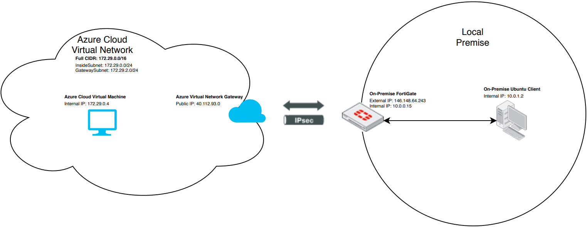

# Terraform Site-to-Site VPN with FortiGate

Terraform modules to configure a Site-to-Site VPN with the Cloud provider and a local FortiGate.

## Manual Steps this Project Automates

- [Connecting a local FortiGate to an AWS VPC VPN](https://docs.fortinet.com/vm/aws/fortigate/6.4/aws-cookbook/6.4.0/506140/connecting-a-local-fortigate-to-an-aws-vpc-vpn)
- [Connecting a local FortiGate to an Azure VNet VPN](https://docs.fortinet.com/document/fortigate/6.4.0/azure-cookbook/989216/connecting-a-local-fortigate-to-an-azure-vnet-vpn)

Example of a Local FortiGate to Azure VNET

## How to use

1. Update `vpn-vars.auto.tfvars` with the values relative to the Cloud provider.

- These variables are declared in `vpn-vars.tf`

- These values are common to **AWS** and **Azure**
  - `region` - the provider region where the VPN will be deployed
  - `group_name` - in Azure used to name the Resource Group, for AWS used for Tagging
  - `gateway_name` - a name for the local network side of the VPN
  - `gateway_ip_address` - the IP address of the local network router
  - `gateway_address_space` - a list of network CIDR that represent the network spaces on the local network
  - `network_cidr` - the cloud provider **vpc** or **vnet** network CIDR
  - `network_name` - the name of the remote (Cloud provider) network
  - `subnets` - subnet name and CIDR that will be part of the created **vpc** or **vnet** network. **Minimally** one subnet needs to be defined.
  - `virtual_gateway_name` - the name of the remote (Cloud provider) gateway

- These additional values are defined for **Azure**
  - `shared_key` - The pre shared key for the VPN
  - `virtual_gateway_connection_name` - the name of the connection (tunnel)
  - `virtual_gateway_public_ip_name` - the name of the IP address for the remote (Cloud provider) gate IP address
  - `virtual_gateway_subnet` - The subnet CIDR for the virtual gateway.

1. Update `fortigate.auto.tfvars` with the values relative to the local FortiGate.

- These variables are declared in `fortigate-vars.tf`. Use of the variables is common to both **AWS** and **Azure**

  - `fortigate_api_token` - The FortiGate API token
  - `fortigate_ip_or_fqdn`- The FortiGate IP / FQDN
  - `fortigate_interface`- The FortiGate interface to use for the tunnel
  - `tunnel_name_prefix` - Tunnels are named with this prefix and sequentially numbered. For example if the prefix is AWSVPN, the tunnels would be named AWSVPN_1 and AWSVPN_2. by default AZURE only creates a single tunnel
  - `tunnel_phase1_proposal` - Phase 1 tunnel encryption proposal
  - `tunnel_phase2_proposal` - Phase 2 tunnel encryption proposal

## Calling the fortigate module

The `fortigate.tf` file defines the call to, and variables passed to the Terraform modules in the fortigate directory.

- `fortigate.tf` in the AWS directory defines two tunnels
- `fortigate.tf` in the Azure directory defines a single tunnel.

## Authenticating to the Cloud and to the FortiGate

There are several ways to authenticate with the respective Cloud providers when using Terraform. Be sure to review the Terraform provider documentation for AWS and Azure.  The provider files in this project utilize:

- Credentials file in the users home directory for AWS - `~/.aws/credentials`
- Environment variables for Azure - `creds.sh`

## Running Terraform

1. Run `terraform init`

- Running a `terraform init` will appropriately  initialize the *main* directory taking into account the call to the Terraform modules in the *fortigate* directory.

1. Run `terraform plan`

- Variable values can be specified in a number of ways
  - In files `.tf`, `.tfvars`, `.auto.tfvars`
  - On the command line using `-var`
    - `terraform plan -var "fortigate_ip_or_fqdn=192.168.20.99"`
  - On the command line referencing a variables files `-var-file`
    - `terraform plan -var-file my_vars.cfg`

1. Run `terraform apply`

To remove resources with Terraform

1. Run `terraform destroy`

## Variables

Variable values can be specified in a number of ways

- In files `.tf`, `.tfvars`, `.auto.tfvars`
- On the command line using `-var`
  - `terraform plan -var "fortigate_ip_or_fqdn=192.168.20.99"`
- On the command line referencing a variables files `-var-file`
  - `terraform plan -var-file my_vars.cfg`
